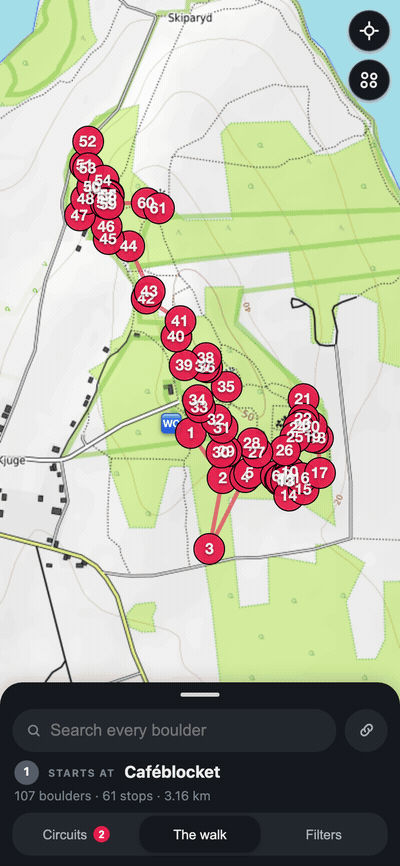

# Kjuge Circles

Interactive walking-route planner for the **Kjugekull** and **Around Ivösjön** bouldering top-lists (Carl Nilsask, 2021) and for the eight **Problem styles** lists of the Kjugekull guidebook.

It also carries **Affonsos Darlings**, a 33-problem warm-up circle of Kjugekull classics (3+ to 5+) proposed by Affonso, and **Jacobs Running**, 24 boulders chosen by the machine from the crag data alone (see below).

The four top-lists are the work of **Carl Nilsask** (2021) — see the [original PDF](https://drive.google.com/file/d/1_B4msOiupGdst2TktklMcE4gQHJrjmW2/view?usp=sharing). The eight style lists (*The highballs*, *The slabs*, *The mantles*, *The Bucket list*, *The traverses*, *The overhangs*, *The dynos*, *The weird ones*) come from the "Problem styles" page of the printed Kjugekull guidebook.

Given the four PDF top-lists, this project takes every boulder graded **L to 7A**, looks up each boulder's location on [27crags](https://27crags.com) (now thetopo.com), and plots the shortest walk through them all. It also supports live filtering by **grade**, **characteristics** (crimpers, slopers, slab, …) and **star rating**.

*Rebuilt from the live app by [`record_demo.js`](record_demo.js) — run it whenever the interface changes.*

## Open it

Open [`index.html`](index.html) in any browser — it's a single self-contained file (Leaflet + OpenTopoMap tiles from CDN, all data embedded). No build step, no server. Map tiles are cached in the browser as you go, so it keeps working at the crag with no signal.

### Features
- **Search** — free-text search over **every** boulder in the dataset (3141 boulders across 14 crags), matching name, grade, crag and sector.
- **Map search** — the search box at the top of the panel draws its hits on the map in **orange**, also when they sit outside the picked circuits and outside the filters. A hit that is off-screen pulls the map to it. Each hit can be added to the current circuit, from the result row or from its map popup.
- **My circle** — add any boulder from the search results to your own circle, name it, and get a walking route through it just like the built-in lists. The **Share** link carries every circle (ids + names), so no backend or login is needed.
- **Paste a list** — paste problem names (one per line, comma separated, or `Name, Grade` pairs) to fill a circle in one go. Numbering, quotes and a header row are stripped; names are read as Kjugekull names first and only then against the other crags; the grade breaks the remaining ties; anything unmatched is reported back.
- **Build a circuit** — boulders are added and removed in the circuit editor (search results, the pasted list, or the × of the *In this circuit* list), and from the stop itself: every boulder of a stop carries a **+** that puts it in the circuit and an **eye** that hides it. A shared link can still carry hidden boulders; the *Circuits* section then offers **Show all**.
- **Circuits** — a tab of its own: multi-select checkboxes over the built-in lists (top-lists, guidebook styles, community) and your own circuits. Selecting several merges their boulders, de-duplicates shared sectors, and recomputes one combined walking route. A list that crosses several crags is counted in crags, not in kilometres, because its route is a visiting order and not a footpath. The picks of the last visit come back on the next one (`localStorage`); a link that carries its own lists always wins over them.
- **Filters** — the third tab: grade, character and star rating, applied to everything drawn on the map, the built-in lists *and* your own circuits. Picking circuits and filtering their contents never change each other. The tab carries a dot while anything is narrowed. Grade chips cover the whole dataset scale (3 … 8C, plus ungraded); a boulder of a circle that a filter removes is marked *filtered out* in the editor.
- **Character filter** — 13 characteristics scraped from 27crags (technical, mental, slopers, crimpers, slab, powerful, dangerous, crack, jugs, endurance, pockets, dyno, traverse). Shows boulders with *any* selected characteristic.
- **Shortest route** — nearest-neighbour + 2-opt TSP over the distinct sectors, anchored at the nearest parking, recomputed in-browser whenever the selection/filters change.
- **The walk** — the first tab: the stops in walking order, each with its boulder count and grade range. A tap on a line opens that stop on the map. Above it sits the **Access & ethics** notice of every crag the walk touches, in the crag's own words.
- **Stops** — a stop reads as a block page: photographs of the block, then every boulder with grade, ⭐ rating (0–3), characteristics, logged ascents, videos, the route description and a link to 27crags, then the block itself on 27crags. The best line of each block is marked **Best on block** — by the same Bayesian score *Jacobs Running* is built with (see below), so a 3.0 from four people cannot outrank a 2.2 from three hundred.
- **Photographs** — the topo pictures of the block, scrolled sideways. A tap opens the big one, captioned with the boulders drawn on it.
- **Share** — the current selection (lists + grade + character filters) is encoded in the URL hash; the **Share** button copies a link that reopens the exact same circuit. No backend required.
- **Base map** — OpenTopoMap: contour lines and forest tracks for the walk-in. Free for light use, no API key.
- **Ticks** — one tap on the ring of a boulder marks it done. The walk then counts what is left, on the day (*100 boulders · 59 stops · 3.13 km · 12 done*) and on every stop. A filter hides what you have finished. Ticks stay in this browser: a share link carries the circuit, not somebody else's ticklist.
- **Offline** — map tiles are kept in IndexedDB, so a walk you have opened once draws again with no signal, and **Save this walk for offline** fetches the rest before you leave the car (about 90 tiles for the whole of Kjugekull). The page, its data and your ticks are already on the disk. Photographs are the exception: the 27crags storage host allows no copy to be kept, so a strip that cannot load takes itself off the stop.
- **Dark** — the chrome follows the system. The map keeps its daylight in both, because contour lines and forest tracks read better that way.
- **The sheet** — one bottom sheet holds everything, and it is always on screen. Its header is the way in: a grab bar, the search box, where the walk starts (*① Starts at Caféblocket*), the day in one line (*100 boulders · 59 stops · 3.13 km*), and a tab bar for **The walk**, **Circuits** and **Filters**. A tap on the grab bar, on a tab, or in the search box folds the list out; a second tap on the grab bar folds it back. A search takes the body over for as long as there is something in the box. A phone parks the header along the bottom edge, over a full-screen map that keeps the route clear of it; a big screen docks the same sheet at the left and starts unfolded.

A static, human-readable itinerary of the per-list routes is in [`ROUTES.md`](ROUTES.md).

## How it was built

1. **Extract links** from `Kjuge top-lists v1.pdf` (annotation URIs) and align each with its grade by text position.
2. **Filter** to grades L–7A.
3. **Locate** every boulder: `27crags` web API (`/api/web01/crags/<id>`) gives per-route `sector_id`; each sector has GPS. Sector = the natural walking granularity. Parking markers come from the same API.
4. **Route** each list with a TSP (nearest-neighbour + 2-opt), anchored at parking.
5. **Characteristics** are only rendered on 27crags route pages for signed-in users, so they were scraped from an authenticated browser session (`.tag` classes on each boulder page). Star ratings come straight from the crag API.
6. **Render** everything into the self-contained `index.html`.

## Data files

| File | What |
|---|---|
| `Kjuge top-lists v1.pdf` | Source lists |
| `map_data.json` | The data embedded in `index.html` (stops, boulders, grades, chars, ratings, per-list routes) |
| `links_grades.json` | Each PDF link paired with its list + grade |
| `located.json` | L–7A boulders with sector GPS |
| `routes.json` | Precomputed per-list TSP order + distance |
| `tags_by_path.json` | Scraped characteristics per boulder |
| `boulder_urls.json` | All 215 boulder URLs |
| `all_boulders.json` | Search index of every boulder in the cached crags (crags with their access notice, sectors with their topo pictures, routes with ascents and videos) |
| `build_all.js` | Builds `all_boulders.json` from `api/*.json` and injects it into `index.html` |
| `build_lists.js` | Holds the eight guidebook style lists, *Affonsos Darlings* and *Jacobs Running*, resolves each name against `api/*.json`, routes them, and writes `map_data.json` + the `var DATA=` line of `index.html` |
| `api/*.json` | Cached 27crags crag API responses (routes + sectors + parking) |
| `scrape.js` / `scrape_min.js` | The in-session character scraper |
| `record_demo.js` | Rebuilds `docs/demo.gif` by driving Chrome over the DevTools Protocol (node built-ins + ffmpeg, no packages) |
| `docs/demo.gif` | The walkthrough at the top of this file |

## Jacobs Running — how the machine chose

No guidebook, only the crag data:

1. **Score every Kjugekull boulder** with at least 15 logged ascents by a Bayesian rating, `(v*R + m*C) / (v + m)` — `v` ascents, `R` its 27crags rating, `C` the crag mean (1.23), `m` = 20. A 3.0 from four people cannot outrank a 2.2 from three hundred.
2. **Fix a grade ladder** so the circuit reads as a session: 6 easy (L–5+), 7 middle (6A–6B+), 4 upper (6C–6C+), 5 hard (7A–7B), 2 elite (7B+ and up).
3. **Search** (simulated annealing, 12 restarts) for the 24 boulders that maximise total score, plus a bonus per covered characteristic and per distinct grade, minus the walking distance and minus any sector asked for more than two problems.
4. **Two swaps by hand**: a real dyno (*Perssons dyno*) and the classic mantle (*Mr Mantel direkt*) in place of two untagged fillers.

Result: 24 boulders, 3+ to 7C+, **all 13 characteristics**, 22 stops, **2.02 km**.

## Notes / caveats
- The two **Kjugekull** lists are a single crag — a tight ~3 km walkable loop.
- The eight **style lists** were read off a photo of the guidebook page. Where the book and 27crags disagree on a grade, the app shows the 27crags grade, because every other number on the map comes from there too.
- [`ROUTES.md`](ROUTES.md) covers the four PDF lists only; the style lists are in the app.
- The two **Around Ivösjön** lists span ~13 crags around the lake (some across water); their "routes" are a visiting *order*, not a footpath. Distances are straight-line sums, not trail-routed.
- Boulders that are unclimbed projects (no 27crags link in the PDF) are excluded.

Lists © **Carl Nilsask** — [original PDF](https://drive.google.com/file/d/1_B4msOiupGdst2TktklMcE4gQHJrjmW2/view?usp=sharing). Boulder data © 27crags / thetopo.com and the respective contributors.
